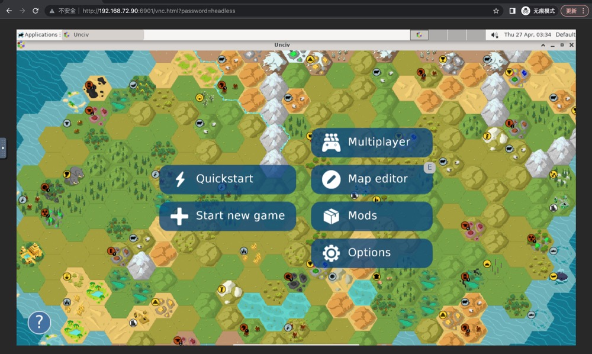

# docker-build-yairm210-unciv

Docker build https://github.com/yairm210/Unciv, see https://hub.docker.com/r/qyvlik/yairm210-unciv

[Unciv](https://github.com/yairm210/Unciv) is an open-source Android/Desktop remake of Civ V, run on jre and using OpenGL.

And now you can run [Unciv](https://github.com/yairm210/Unciv) in container !



# Ubuntu 20.04

Host system is Ubuntu 20.04(Ubuntu focal)

- docker run

```bash
docker run \
  --rm \
  -it \
  -p "6901:6901" \
  -p "5901:5901" \
  -v "/home/ubuntu/docker-volumes/unciv-docker/unciv:/home/headless/.local/share/Unciv" \
  qyvlik/yairm210-unciv:4.8.6 \
  /home/headless/Desktop/Unciv.sh
```

- docker-compose

```yaml
version: '2.0'

services:
  unciv:
    image: qyvlik/yairm210-unciv:4.8.6
    command: /home/headless/Desktop/Unciv.sh
    volumes:
      - "./tmp/your-game-data:/home/headless/.local/share/Unciv"
    environment:
      - VNC_RESOLUTION=1360x768
    ports:
      - "6901:6901"
```

Open http://localhost:6901/vnc.html?password=headless

# Ubuntu 22.04

Host system is Ubuntu 22.04(Ubuntu jammy)

- docker run

```bash
docker run \
  --rm \
  -it \
  -p "6901:6901" \
  -p "5901:5901" \
  -v "/home/ubuntu/docker-volumes/unciv-docker/unciv:/home/headless/.local/share/Unciv" \
  qyvlik/yairm210-unciv:4.8.6-jammy \
  /home/headless/Desktop/Unciv.sh
```

- docker-compose

```yaml
version: '2.0'

services:
  unciv:
    image: qyvlik/yairm210-unciv:4.8.6-jammy
    command: /home/headless/Desktop/Unciv.sh
    volumes:
      - "./tmp/your-game-data:/home/headless/.local/share/Unciv"
    environment:
      - VNC_RESOLUTION=1360x768
    ports:
      - "6901:6901"
```

Open http://localhost:6901/vnc.html?password=headless

# VNC environment

See https://github.com/accetto/headless-drawing-g3/blob/v22.12.1/docker/Dockerfile.xfce.drawing#L145-L152

- `VNC_COL_DEPTH`
- `VNC_PORT`
- `VNC_PW`: password
- `VNC_RESOLUTION`: 1360x768

# Ref

1. https://github.com/yairm210/Unciv
2. https://github.com/accetto/headless-drawing-g3
